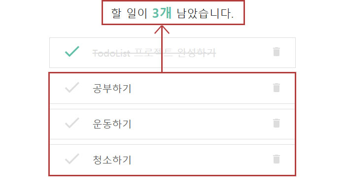

# Todo List

- 개발기간: 2021.09.18 ~ 2021.09.21
- 개발언어: JavaScript
- 개발 라이브러리: React.js

   

## 🔸프로젝트 설명
디데이를 설정해 디데이 날짜까지 해야 할 일을 추가하고 체크하는 기능을 구현하였습니다.   
   
- 원하는 년도, 월, 일을 입력하면 오늘 날짜를 기준으로 남은 날짜를 계산해줍니다.   
- 해야 할 일 항목에 추가를 원할 땐 아래의 플러스 버튼을 클릭해 할 일을 추가할 수 있고, 추가된 할 일을 원하지 않을 땐 삭제가 가능합니다.   
- 남은 할 일을 카운터 해줍니다.   
- 디데이 날짜 폼에 아무것도 입력하지 않을 시 남은 날짜를 그대로 0일로 셋팅합니다.
- 할 일을 추가하는 입력폼에 입력이 제대로 되지 않을 시 경고창이 뜹니다.   
 
 

- 디데이 셋팅 및 카운터   

- 할 일 추가하기

- 할 일 카운터

- 추가 폼에 입력이 제대로 되지 않았을 때
